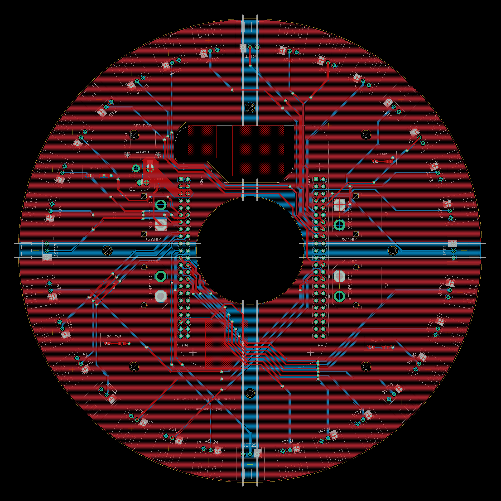

# Demo Board

Included in this folder is a demo board designed in Eagle. It is very impractical, and includes a library of parts. It has not been ordered and tested, so no promises. This is to illustrate pinout, and how we might use this on the hardware side.

**Hardware is provided without a warranty. 
All risk is assumed by the end user.**

### Files

- throwing_bagels.lbr - Library of parts.
- throwing_bagels.sch - Board schematic
- throwing_bagels.brd - Board layout.

### Details

This board has **4** power zones, each one containing **8** data lines. **S0-S7** are on **5V_1**, and so on. The beaglebone is powered off of **XT5** or **5V_2** depending on if you close **JP1**. The beaglebones are prone to browning out if sufficent power is not provided, this seems to knock the NIC offline first. **We do not, recommend changing the pinout of the BBB.***
